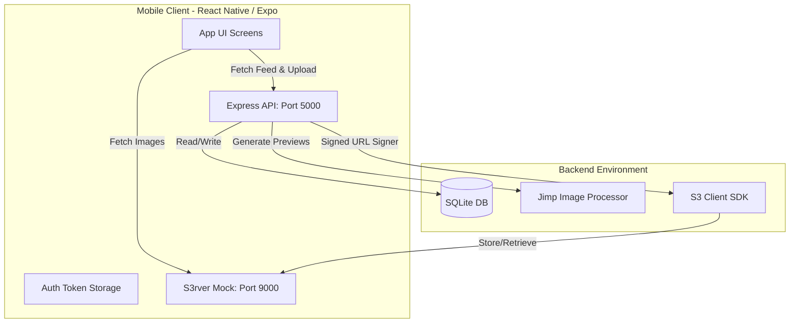

# Paid Media Locker

A secure, full-stack system designed to let users upload images, set coin unlock prices, and monetize them. Other users can view a processed preview of the image and spend coins from their starting wallet balance to unlock the original, full-resolution image.

This project consists of:
1.  **Backend**: Node.js/Express, SQLite (Sequelize ORM), and a programmatically-managed local S3 mock server (`s3rver`).
2.  **Frontend**: A lightweight, premium dark-themed React Native Android application built with Expo, with pre-compiled APK ready for deployment.

---

## Technical Stack & Architecture



### 1. Backend (Express & S3rver)
*   **Express**: RESTful API endpoints for user registration, login, feed retrieval, media uploading, unlocking content, and wallet history.
*   **Sequelize & SQLite**: SQLite database for local, zero-setup storage. Sequelize provides model-based schemas and atomic transactions.
*   **S3rver**: A local, mocked S3-compatible service. It enables testing full S3 uploads, downloads, and signed URL signatures completely offline without AWS credentials.
*   **Jimp**: A pure-JavaScript image processing library. Jimp handles server-side image resizing and blurring to generate previews, eliminating native compiler dependencies (like `sharp` C++ compile issues) on Windows.

### 2. Frontend (React Native & Expo)
*   **Expo SDK 57**: Modern React Native container using Expo Router.
*   **Premium Obsidian Theme**: Dark-mode user interface utilizing card containers, gold coin accents, checkmarks, blurring overlays, settings configuration, and clean loader spinners.
*   **AsyncStorage**: Stores user authentication JWT tokens and custom server connection URLs.
*   **Expo Image Picker**: Integrates native Android photo library selectors.

---

## Security Architecture & Decisions

Protecting paid media is the core requirement of this system. We implemented the following layers of security:

### 1. Private S3 Media Storage
All uploaded media is treated as private by default:
*   Original files are uploaded to the S3 bucket path prefix `media/original/` with unique, cryptographically-generated UUID filenames.
*   Preview files are uploaded to `media/preview/`.
*   Direct public access to the S3 bucket is restricted; clients cannot guess filenames or query files directly.

### 2. Server-Side Image Processing (Previews)
To prevent unauthorized clients from downloading full-resolution images, **locked content never leaves the S3 original bucket folder**.
*   Upon upload, the backend processes the original image using `Jimp`.
*   A downscaled, heavily blurred (blur radius 20) version is saved as the preview.
*   When a user views a locked item, the backend *only* returns a temporary link to this blurred preview. The original image's coordinates/pixels are never sent to a locked user's device.

### 3. Short-Lived S3 Presigned URLs
Images in our local S3 bucket are delivered via **secure, temporary signed URLs**:
*   The backend validates if the requesting user is the uploader OR has already purchased the media.
*   If validated, the backend signs a temporary `GetObject` request containing a signature token.
*   **Expiration Time**: URLs are set to expire in **60 seconds**. This prevents users from copying and sharing URLs with other users, as the links will instantly become invalid.
*   Previews are also loaded via signed URLs to prevent hotlinking and keep the entire S3 bucket structure hidden.

### 4. Double-Sided Transaction-Safe Unlocking
The unlocking of media involves transfer of coins from the buyer's wallet to the creator's wallet.
*   To prevent double-spending, race conditions, or network dropouts from causing database inconsistencies, the entire unlock process runs inside an **atomic SQL database transaction**.
*   If the buyer has insufficient funds, the transaction is rolled back.
*   If successful, the buyer's balance is decremented, the uploader's balance is incremented, the unlock event is logged, and debit/credit ledger records are committed simultaneously.

---

## Database Schema

We use SQLite for self-contained relational storage. Below is the entity schema:

```mermaid
erDiagram
    User {
        int id PK
        string username UNIQUE
        string passwordHash
        int walletBalance
        datetime createdAt
    }
    Media {
        int id PK
        string title
        int price
        string s3OriginalKey
        string s3PreviewKey
        int uploaderId FK
        datetime createdAt
    }
    Unlock {
        int id PK
        int userId FK
        int mediaId FK
        int priceSpent
        datetime createdAt
    }
    Transaction {
        int id PK
        int userId FK
        int amount
        string type
        string description
        datetime createdAt
    }

    User ||--o{ Media : "uploads"
    User ||--o{ Unlock : "purchases"
    Media ||--o{ Unlock : "is-unlocked-by"
    User ||--o{ Transaction : "records"
```

---

## Setup & Local Run Instructions

### Prerequisites
*   Node.js (v18+ recommended)
*   npm

### 1. Start the Backend
Navigate to the `backend` folder, install packages, and start the development server:
```bash
cd backend
npm install
npm start
```
The server will boot up and:
1.  Launch `s3rver` on port `9000` (storing files locally in `./s3-storage`).
2.  Sync the SQLite database (saved as `database.sqlite` in the backend root).
3.  Auto-detect your computer's local network IPv4 address (e.g. `192.168.1.5`).
4.  Expose the Express REST API on port `5000` on both `localhost` and your network IP.

### 2. Start the Frontend (Expo Developer Mode)
To run the Expo app in development mode:
```bash
cd frontend
npm install
npm start
```
You can scan the QR code using the Expo Go app on your Android device.

---

## Running Automated Backend Tests

We have written integration tests covering user registration, login, profile retrieval, and wallet ledger operations.

To run the backend test suite:
```bash
cd backend
npm run test
```
*Note: The test suite mocks the S3 service so that tests run completely in-memory without starting local ports or writing to the disk.*

---

## Docker Setup (Bonus Point)

If you prefer running the backend in Docker containers:
1.  Make sure Docker and Docker Compose are installed.
2.  From the project root directory, run:
    ```bash
    docker-compose up --build
    ```
The container will spin up the backend API and S3rver, mapping ports `5000` and `9000` to your host machine, with data persistent in named docker volumes.

---

## Compiled APK & Demo Credentials

We have compiled a release-ready APK signed with Gradle's debug configuration. 

### APK File Location
The compiled APK file is located at:
📁 **`[project-root]/frontend/android/app/build/outputs/apk/release/app-release.apk`**
*(Absolute Path: `file:///C:/Users/Hp/.gemini/antigravity/scratch/paid-media-locker/frontend/android/app/build/outputs/apk/release/app-release.apk`)*

### Live Demo Instructions & Credentials
To test the APK on an Android device or emulator:
1.  Start your local backend server using `npm start` in the `backend` folder. Note the network address printed in the console (e.g., `http://192.168.1.5:5000`).
2.  Install the `app-release.apk` on your Android device.
3.  On the Login screen, click the **Configure API Connection** link at the bottom and enter your backend's network IP (e.g. `http://192.168.1.5:5000/api`). If you are running the app on the same machine's Android emulator, use `http://10.0.2.2:5000/api`.
4.  **Demo Credentials**:
    *   You can register any new username (it automatically credits `1000` starting coins).
    *   **Pre-created Account 1 (Uploader)**:
        *   **Username**: `alice`
        *   **Password**: `Alice123`
    *   **Pre-created Account 2 (Buyer)**:
        *   **Username**: `bob`
        *   **Password**: `Bob123`
